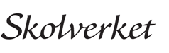

# 1. Inledning

Multifaktorsautentisering (MFA) är i vissa fall ett obligatoriskt
autentiseringskrav för åtkomst till Skolverkets tjänster i federationsförbundet
FIDUS. Exempel på detta är tjänsten för digitala nationella prov. Elever, som
ska skriva prov, undantas dock från detta krav och Skolverket tillåter elever
att logga in med användarnamn och lösenord i anslutning till den
identifieringstjänst (identity provider, IdP) som skolan använder i
federationsförbundet FIDUS.

Denna bilaga beskriver de krav som ställs för identitetskontroll när användarens
identitet behöver verifieras med två eller flera autentiseringsfaktorer.

# 2. Målgrupp och tillämpning av krav

Krav i detta dokument är riktade till användarorganisationer – skolor, huvudmän,
lärosäten som använder Skolverkets tjänst för digitala prov.

Användarorganisationerna ska ha som målsättning att tillämpa dessa krav när de
själva står för utgivningen av digitala identiteter men även när en
e-legitimation används från extern leverantör.

# 3. Multifaktorautentisering

En eller flera separata inloggningsuppgifter (credentials) som tillsammans eller
var och en för sig implementerar olika autentiseringsfaktorer och uppfyller
kraven nedan **skall** användas. Kravet kan uppfyllas antingen genom

-   MFA1: användarorganisationen implementerar MFA på egen hand (i anslutning
    till egen IDP)

-   MFA2: genom ID-länkning till en extern leverantör av digitala identiteter

-   MFA3: både inloggning samt MFA med eduID

# 4. Säkerhetskrav på utgivare av användares digitala identitet

Det är viktigt att särskilja vem som är utgivare av användares digitala
identitet.

-   I fallet MFA1 är det oftast användarorganisationen själv som är som utgivare

-   I fallet MFA2 är det leverantören av den digitala legitimationen som är
    utgivare

-   I fallet MFA3 är det eduID leverantören som är utgivare

Den kravställningen som gäller för utgivare kommer från DIGG (Myndigheten för
digital förvaltning). Styrkan i kravställningen är uppdelad beroende på
tillitsnivån som krävs vid autentiseringen.

**Utgivare av digitala identiteter bör uppfylla krav på minst tillitsnivå 2, enligt DIGG:s tillitsramverk[1].**

[1]: Tillitsramverk från DIGG där tillitsnivåerna specificeras finns här:
    [https://www.digg.se/globalassets/dokument/digital-identitet/e-legitimering/kvalitetsmarket-svensk-e-legitimation/tillitsramverk/tillitsramverk-for-svensk-e-legitimation.pdf](https://www.digg.se/globalassets/dokument/digital-identitet/e-legitimering/kvalitetsmarket-svensk-e-legitimation/tillitsramverk/tillitsramverk-for-svensk-e-legitimation.pdf)

# 5. MFA1: Användarorganisationen implementerar MFA på egen hand 

Vid egen MFA-lösning i anslutning till egen IdP **skall** token för
multifaktorautentisering användas för skydd mot cyberattacker, nätfiske och
andra hot. Exempel på tokens som uppfyller detta är bland annat alla

-   **tokens som är certifierade enligt FIDO2**

-   **PKI-baserade smarta kort (t ex baserade på PIV eller PKCS\#15**).

# 6. Om en organisation väljer en lösning som inte finns på listan ovan rekommenderas kontakt med Skolverket för samråd kring den valda lösningen MFA2: MFA genom ID-länkning till en extern leverantör av digitala identiteter

*Förväntningen är att initial inloggning sker via egen IdP men ID länkning sker
till extern leverantör för MFA (helt egen eller med hjälp av en integratör).*

*Organisationen står själv för den tekniska integrationen med den externa
leverantören av digitala identiteter för MFA.*

Följande implementationer rekommenderas i detta fall:

-   **Tillitsnivå 3 eller högre enligt DIGG**

    Myndigheten för digital förvaltning (DIGG) har tagit fram tillitsramverket
    för kvalitetsmärket Svensk e-legitimation, som beskriver tre tillitsnivåer
    (2-4). Dessa nivåer ställer högre krav på att användaren verifierar sin
    identitet. Ju högre tillitsnivå, desto säkrare är e-legitimeringen, både när
    det gäller teknisk och administrativ säkerhet. Exempel på lösningar som är
    godkända på tillitsnivå 3 eller högre i regelverket är AB Svenska Pass, och
    Freja eID+.

    -  **BankID**

	    BankID är en elektronisk ID-handling, som är godkänd på tillitsnivå 3
        i tillitsramverket för kvalitetsmärket Svensk e-legitimation. **De
        kommersiella villkoren för BankID tillåter inte ID-växling**. De
        medlemsorganisationer som använder BankID för inloggning till en tjänst
        i FIDUS måste därför alltid signalera autentiseringen vid utfärdande av
        SAML-intyget. Signaleringen är nödvändigt för att kunna säkerställa att
        autentisering med BankID inte ska kombineras med ID-växling i någon
        form.

-   **Tillitsnivå Väsentlig (Substantial) eller Hög (High) enligt eIDAS**

    eIDAS knyter samman e-legitimationssystemen i alla EU:s medlemsländer.
    Väsentlig motsvarar den svenska tillitsnivån 3, enligt DIGG och Hög kan
    likställas med tillitsnivån 4. Sveriges tillitsnivå 4 omfattar dock krav på
    bland annat personligt besök vid förnyelse av en e-legitimation

-   **EduID Proxy IDP**

    EduID är en federerad digital identitet från SUNET (Vetenskapsrådet) och
    det har stöd för Freja eID+ och alla U2F/FIDO2-kompatibla tokens. En
    medlemsorganisation i FIDUS kan använda sin egen IdP för den initiala
    inloggningen och vid en MFA-begäran höja tilliten genom ID-länkning till
    eduID Proxy IDP. Val av MFA-lösning för eduID görs av
    användarorganisationen.

# 7. MFA3: Inloggningen och MFA sker via extern IDP 

-   **EduID**

    Organisationer som saknar egen IdP, men har behov av att få åtkomst till
    tjänst i FIDUS kan även välja att använda eduID som sin IdP. EduID har stöd
    för Freja eID+ och alla U2F/FIDO2-kompatibla tokens

# Revisionshistorik

| Version           | Datum      | Författare          | Kommentar                                                                                                                         |
|-------------------|------------|---------------------|-----------------------------------------------------------------------------------------------------------------------------------|
| 0.1               | 2019-02-26 | Renee Sundström     | Konstruktion av dokument                                                                                                          |
| 0.2               | 2019-03-04 | Börje Shameti Lewin | Liten bearbetning                                                                                                                 |
| 0.21              | 2019-05-17 | Renee Sundström     | Uppdateringar efter möte med DIGG samt uppdaterad definitionslista                                                                |
| 0.3               |            |                     | Överspelad                                                                                                                        |
| 0.4               | 2019-06-27 | Börje Shameti Lewin | Gjort antaganden och svarat på kommentarer.                                                                                       |
| 0.5               | 2019-07-23 | Börje Shameti Lewin | Städat bort kommentarer.                                                                                                          |
| 0.6               | 2020-08-18 | Edin Nuhic          | Gjort om efter input från Aras och Leif, tagit bort nivå 2 DIGG och självdeklarerad MFA, lagt till eduID Tagit bort tillämplighet |
| 0.7               | 2020-09-10 | Aras Kazemi         | Justeringar för att öka läsbarhet samt nytt avsnitt om BankID                                                                     |
| 0.8               | 2020-09-15 | Edin Nuhic          | Pekat ut DIGG nivå 3 på nytt, infört rubriken målgrupp, redigerat efter LJ kommentarer                                            |
| 0.82              | 2020-09-22 | Edin Nuhic          | Efter Leifs inrådan – skrivit i kapitlet 3 att de lösningar som inte finns i detta dokument kräver granskning.                    |
| 0.83              | 2020-10-06 | Edin Nuhic          | Infört rubriken 4 som pekar ut DIGG:s tillitsramverk                                                                              |
| 0.84              | 2020-11-03 | Aras Kazemi         | Uppdatering avsnitt 6                                                                                                             |
| 0.85              | 2020-11-05 | Edin Nuhic          | Accepterat Aras ändringar samt efter Påls kommentar                                                                               |
| 0.86              | 2020-11-09 | Edin Nuhic          | Ändrat formulering om de två varianterna av ID-länkning                                                                           |
| 0.87              | 2020-11-19 | Edin Nuhic          | Lagt till MFA3                                                                                                                    |
| 0.88              | 2020-11-30 | Edin Nuhic          | Flyttat upp texten för BankID under DIGG/tillitsnivå 3 efter granskning av Pål Axelsson, SWAMID                                   |
| 0.89              | 2021-01-07 | Edin Nuhic          | Tagit bort exemplet om gymnasieelever från BankID stycket                                                                         |
| 0.90              | 2021-01-11 | Edin Nuhic          | Ändringar efter kommentarer från Marcello Marrone                                                                                 |
| 0.93              | 2021-01-28 | Edin Nuhic          | Ändringar efter slutgiltiga justeringar av Marcello Marrone                                                                       |
| 1.0               | 21-04-15   | Callisto Utriainen  | Federationsrådet överens om innehållet. Inga ändringar från senaste versionen.                                                    |
