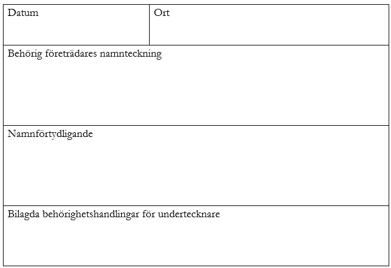

Verksamhetsutvecklingsstöd Dnr. 2021:831-2 - 2021-03-24

# Deklaration av medlemskap i FIDUS

Nedan angiven federationsoperatör förklarar härmed gentemot Federationsrådet att
den vill ansluta nedan angiven federation till FIDUS, och att den kommer att
följa FIDUS interfederationsramverk [FIDUS Interfederationsramverk.docx] och:

1.  Federationsoperatören kommer att publicera metadata om de tjänster och
    identitetsleverantörer som ska ingå i interfederationen FIDUS.

2.  Federationsoperatören ska antingen

    a.  För federationsverksamhet vid var tid kunna uppvisa ett giltigt
        certifikat avseende aktuell version av ISO/IEC 27001

        i.  *Eller (om statlig myndighet)*

    b.  uppfylla kraven i

        i.  MSBFS 2020:6 föreskrifter om informationssäkerhet för statliga
            myndigheter

        ii.  MSBFS 2020:7 Föreskrifter om säkerhetsåtgärder i informationssystem
            för statliga myndigheter.

3.  Federationsoperatören ska tydligt märka sina entiteter (medlemmarnas
    metadata) med vilken federation entiteterna kommer ifrån (genom att fylla i
    attributen ”Registration Authority” i metadatafilen. ”Registration
    Authority” är en unik identifierare för federationen).

4.  Federationsoperatören ska ha en kontaktpunkt för sina federationsmedlemmar
    för att hantera tekniska problem.

5.  Federationsoperatören ska ha ett avtal eller motsvarande som definierar
    medlemskapet mellan federationen och dess medlemmar.

6.  Federationsoperatören. ska utan onödigt dröjsmål informera FIDUS (via
    federationsrådet samt support) om förhållanden som påverkar
    federationsoperatörens möjligheter att tillhandahålla sina tjänster på ett
    tillfredsställande sätt.

7.  Federationsoperatören kommer att ge sådant bistånd till andra deltagande
    federationer som de rimligen kan begära rörande offentliggörandet eller
    användningen av metadata om entiteter.

8.  Federationsoperatören kommer att på begäran tillhandahålla FIDUS sådan
    dokumentation eller avtal som behövs för att förtydliga federationens
    registreringsförfaranden och därmed de förtroendenivåer som federationens
    metadata kan ges.

9.  Klagomål som rör en medlem ska göras till operatören av den deltagande
    federationen. Klagomål hanteras enligt reglerna för den deltagande
    federationen och styrs av svensk lag och jurisdiktion.

10. Varken förekomsten av denna deklaration, eller utbytet av information som
    tillåts genom den, ska skapa nya juridiska skyldigheter eller rättigheter
    mellan medlemmarna eller mellan operatörerna av någon federation.

1.  I synnerhet skapar denna deklaration ingen rätt till medlemskap eller ger
    någon tillgång till tjänster mellan medlemmar i någon federation.

2.  Ingen ekonomisk ersättning förväntas mellan FIDUS och federationsoperatörer
    och eventuella ekonomiska överväganden mellan medlemmar eller medlemmar och
    operatörer ligger utanför ramen för denna deklaration.

3.  Om federationsoperatören vill avsluta sin federations medlemskap i FIDUS,
    kommer den att meddela detta tolv månader i förväg till Federationsrådet i
    enlighet med FIDUS ramverk.

4.  Federationsoperatören ska på begäran av Skolverket lämna uppgifter om hur
    verksamheten ägs och styrs

5.  Federationsoperatören ska förfoga över tillräckliga ekonomiska medel för att
    kunna bedriva verksamheten i minst ett år

6.  Federationsoperatören som upphör med sin verksamhet ska informera sina
    medlemmar och Federationsrådet. Den ska hålla arkiverat material
    tillgängligt. Tiden för bevarande ska inte understiga tio år och material
    ska kunna tas fram i läsbar form under hela denna tid, såvida inte krav på
    gallring påkallas ur integritetssynpunkt och har stöd i lag eller annan
    författning

7.  Federationsoperatören som inte är en myndighet ska drivas som registrerad
    juridisk person samt teckna och vidmakthålla för verksamheten erforderliga
    försäkringar.

8.  Federationsoperatören åtar sig att tillhandahålla kontaktuppgifter (namn,
    efternamn, telefonnummer, mejladress – företrädesvis en funktionsbrevlåda)
    till följande roller i federationen:

    1.  Kontaktperson för Avtalet och administrativa frågor

    2.  Kontaktperson som är behörig att anmäla uppgifter för interfederering om
        manuell hantering skulle vara nödvändig

    3.  Kontaktperson som är behörig att hantera säkerhetsincidenter

    4.  Kontaktperson för supportfrågor

Skulle någon bestämmelse i denna deklaration befinnas vara ogiltig, olaglig
eller otillåten i någon jurisdiktion ska detta inte påverka giltigheten,
lagenligheten eller verkställigheten av någon annan bestämmelse. Federationen
går med på att ersätta en sådan bestämmelse med en bestämmelse som har
väsentligen samma verkan men som inte är ogiltig, olaglig eller ej verkställbar.

Begreppen i denna federationsdeklaration ska ha den betydelse som anges i
FIDUS Interfederationsramverk.

## Underskrift Federationen

Federationens underskrift genom behörig företrädare. Genom undertecknandet
ges ovan angivna kontaktpersoner fullmakt/intygas att ovan angivna
kontaktpersoner är behöriga att för Federationens räkning agera inom ramen
för respektive angiven funktion.

## Revisionshistorik

| Version           | Datum      | Författare         | Kommentar                                                                                                                                                         |
|-------------------|------------|--------------------|-------------------------------------------------------------------------------------------------------------------------------------------------------------------|
| 0.1               | 2020-11-23 | Edin Nuhic         | Första version, granskat och avstämt i Skolverkets FIDUS teamet                                                                                                   |
| 0.2               | 2020-11-26 | Edin Nuhic         | Rättningar efter granskning av Pål Axelsson från SWAMID                                                                                                           |
| 0.3               | 2020-11-29 | Edin Nuhic         | Rättningar efter granskning av Pål Axelsson från SWAMID                                                                                                           |
| 0.4               | 2020-12-02 | Edin Nuhic         | Rättningar efter granskning, tog bort Skolverket som part, avstavning                                                                                             |
| 0.5               | 2020-12-21 | Edin Nuhic         | Initiala ändringar efter granskningen av Skolverkets jurister Harriet Schaffer Ullman och David Embretsen                                                         |
| 0.6               | 2021-01-07 | Edin Nuhic         | Ändringar i punkt 15 och 17                                                                                                                                       |
| 0.7               | 2021-01-11 | Edin Nuhic         | Ändringar efter kommentarer från Skolfederationens jurister                                                                                                       |
| 0.81              | 2021-01-28 | Edin Nuhic         | Infört begreppet interfederationsramverk, och tagit bort policy, efter inrådan från Skolverkets jurister, justerat efter ändringar, samt Marcello M korrigeringar |
| 1.0               | 2021-03-24 | Callisto Utriainen | Inga ändringar, godkänt av FIDUS Federationsråds styrgrupp                                                                                                        |
